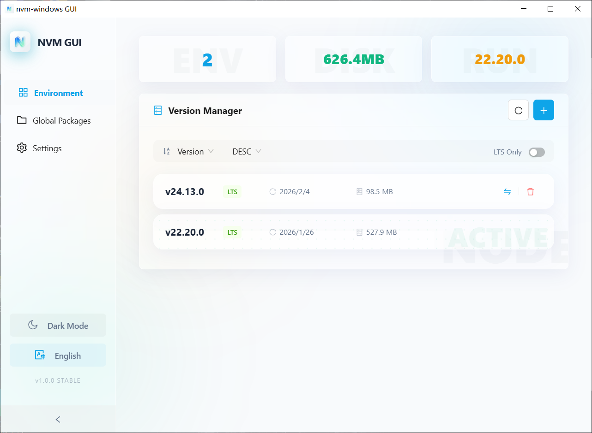
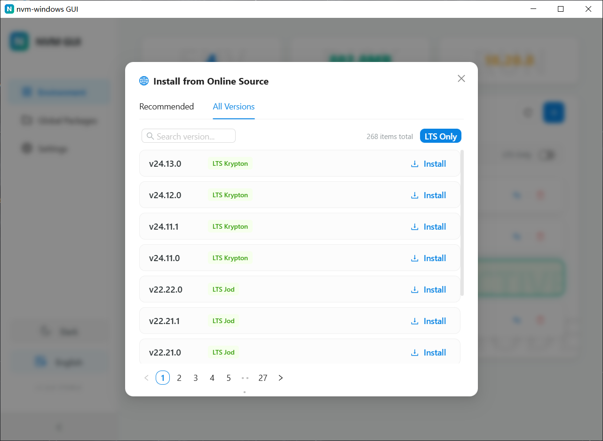
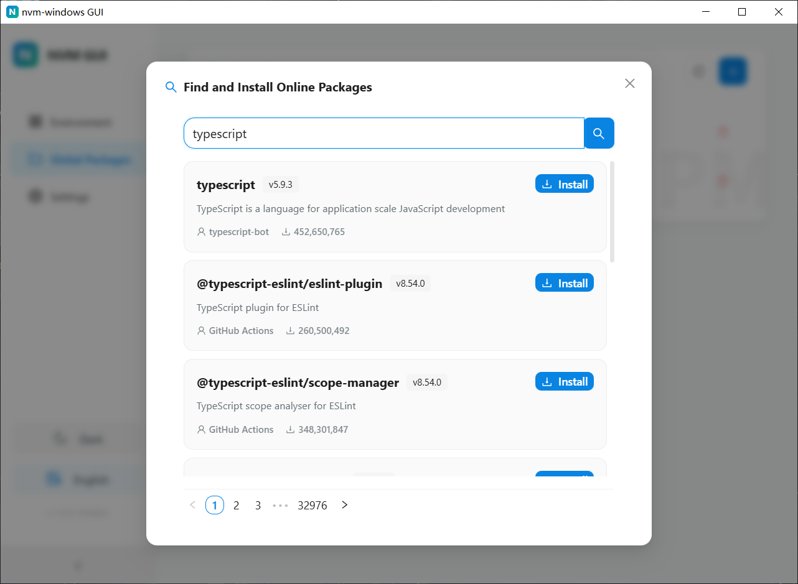
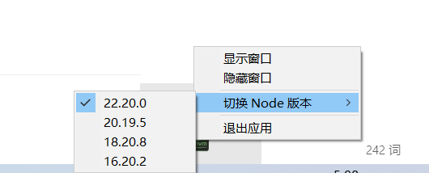

# nvm-windows GUI (Tauri v2 Edition)

[English](README.md) | [中文](README.zh.md)

nvm-windows 的图形化管理界面，基于 Tauri v2 架构构建，极致轻量，极速响应。

<video src="https://github.com/Mr-Youngs/nvm-windows-GUI/raw/main/assets/media/demo.mp4" controls="controls" style="max-width: 100%;">
  您的浏览器不支持 video 标签。您可以直接 [点击此处查看/下载演示视频](https://github.com/Mr-Youngs/nvm-windows-GUI/raw/main/assets/media/demo.mp4)。
</video>

## 项目截图

## 功能特性

- ✅ **精简体积**: 核心执行文件仅 ~3.5MB。
- ✅ **版本管理**: 查看、安装、切换、卸载 Node.js 版本。
- ✅ **智能推荐**: 自动拉取 Node.js 官方 LTS 及最新版本推荐。
- ✅ **镜像优化**: 内置镜像预设，支持 multi-threaded 下载速度测试。
- ✅ **包管理**: 全局/项目 npm 包查看与过时检测。
- ✅ **磁盘统计**: 实时统计各版本的磁盘占用情况。

## 技术栈

- **Frontend**: React + TypeScript + Ant Design
- **Backend**: Rust (Tauri v2)
- **Bundler**: Webpack + Webpack Dev Server

## 说明与致谢

- 本项目为 [nvm-windows](https://github.com/coreybutler/nvm-windows) 的第三方图形化界面工具。
- 核心功能依赖于 `nvm-windows` 命令行工具，请在使用前确保系统中已安装 `nvm`。
- 感谢 [coreybutler](https://github.com/coreybutler) 开发的优秀开源项目 `nvm-windows`。

## 许可证

MIT License
